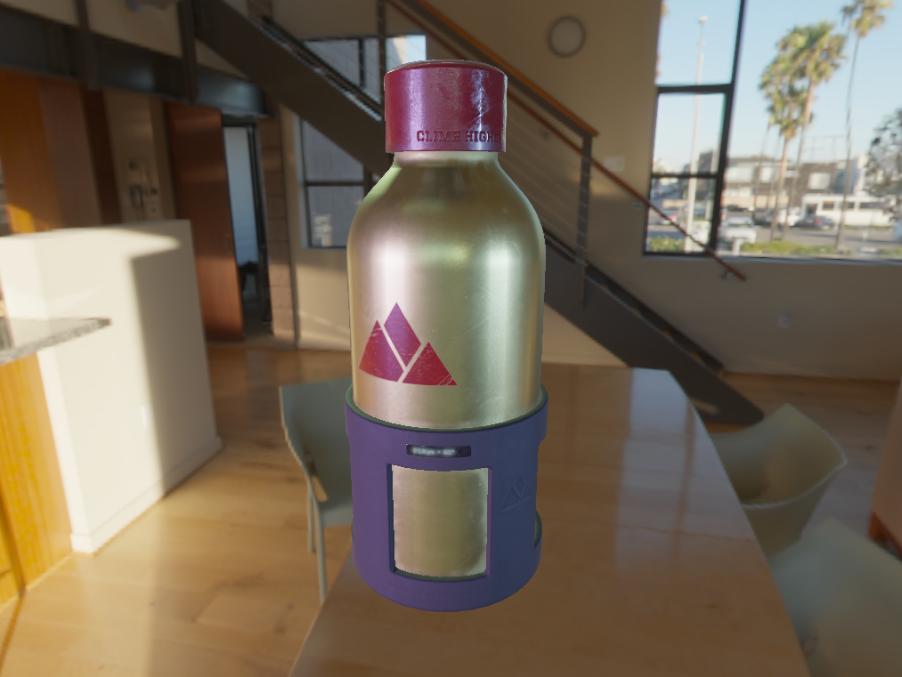

# opengl_sandbox

Projects acts as a sandbox to learn and explore computer graphics and game engine concepts. 

---

### Features
* OpenGL draw calls based on instanced indirect drawing commands
* Bindless textures packs aiming to reduce OpengGL API call counts
* glTF2.0 model import
* Image based lighting
* PBR shading

### Ideas in development
* Template-based modular graphics pipeline definition
* Deferred rendering pipeline
* Procedurall map generation with automatically derived geometric constraints based on provided tile meshes
* Custom ECS framework
* Skeletal animation system
* Quad-tree space partitioning
* Multithreaded draw commands preparation
---
### Build instructions

Code has been tested on Ubuntu 20.04 with both GCC and Clang compilers, on a system with NVidia graphics card. Support for ```GL_ARB_bindless_texture``` and ```GL_ARB_shader_draw_parameters``` OpenGL extension is required.

* Clone the repository with recursive flag

```
    git clone --recursive https://github.com/wroblewskipawel/rupture.git
```
* Build using CMake and Ninja
```
    mkdir build
    cd build
    cmake .. -G "Ninja"
    cmake --build .
    cmake --build . --target UPDATE_SHADERS
    cmake --build . --target UPDATE_ASSETS
```
---

## PBR Demo instructions

* ```Q``` to quit the application
* ```[ ]``` to change camera type
* ```WSAD, MMB``` to control camera


